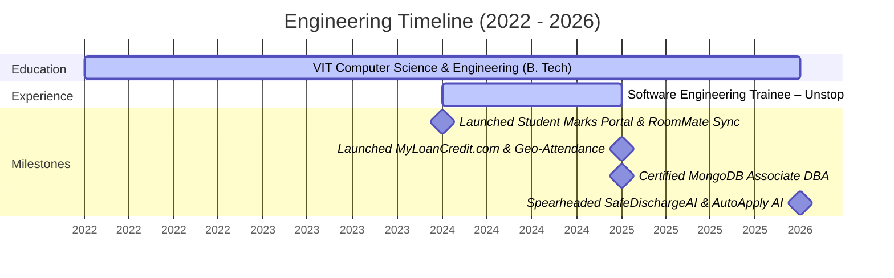

<!-- HEADER SECTION -->
<!-- A dynamic waving banner with Tokyonight color palette, aligning with the premium dark theme. -->

  

<!-- TYPING ANIMATION -->
<!-- Handcrafted typing SVG featuring modern, backend-focused roles. -->

  

<!-- SOCIAL PANELS & KEY STATS -->
<!-- Standardized flat-square badges showing high-quality networks and visitor traffic. -->

  
  
  
  
  
  

 

<!-- ABOUT ME & ELEVATOR PITCH -->
<!-- High-impact introduction positioning Shubham as an SDE with backend and AI experience. -->
## 👨‍💻 Professional Summary

I am a **Software Development Engineer** specializing in building high-performance backend systems and integrating artificial intelligence into production workflows. With deep expertise in **Java** and **Node.js**, I design and deploy RESTful APIs, optimize complex database schemas, and engineer intelligent agentic solutions. I focus on translating architectural concepts into secure, scalable, and developer-first applications.

---

<!-- CURRENTLY BUILDING & FOCUS -->
<table width="100%" border="0" cellpadding="8" cellspacing="0">
  <tr>
    <td width="50%" valign="top">
      <h3>🚀 Currently Building</h3>
      <ul>
        <li><b>AutoApply AI Resume Tailoring:</b> Engineering a job autofill & resume tailored parsing engine utilizing Chrome Manifest V3, Node.js, Express, MongoDB, and LLMs.</li>
        <li><b>ATS Optimizer Workflows:</b> Structuring JD parsing algorithms, PDF text extractors, and automated form injectors.</li>
        <li><b>Backend Systems:</b> Designing scalable microservices using <b>Java</b>, <b>Node.js</b>, and <b>Spring Boot</b>.</li>
      </ul>
    </td>
    <td width="50%" valign="top">
      <h3>💼 Professional Status</h3>
      <ul>
        <li><b>Open to Opportunities:</b> Software Development Engineer (SDE), Backend Engineer, Java Developer, Full-Stack Engineer.</li>
        <li><b>Focus Areas:</b> RESTful APIs, Secure JWT Authentication, Database Schema Tuning, AI/LLM Integration.</li>
        <li><b>Relocation:</b> India / International (Remote & On-site).</li>
      </ul>
    </td>
  </tr>
</table>

---

<!-- ENGINEERING HIGHLIGHTS -->
## ✔️ Engineering Core Competencies

*   **Production Applications:** Deployed end-to-end full-stack web applications and browser automation extensions.
*   **Secure Route Guards:** Enforced JWT authentication, role-based access control (RBAC), and HTTPS configurations.
*   **High Performance:** Optimized MongoDB query indexes to support 1,500+ records and ensure sub-50ms validation latencies.
*   **AI Integrations:** Programmed multi-agent clinical verifiers and natural-language database query engines via Gemini APIs.
*   **Testing & CI/CD:** Validated 20+ endpoints with Postman automation scripts, logging frameworks, and version controls.

---

<!-- SKILLS GRID -->
## 🛠️ Technical Ecosystem

| Category | Technologies & Tools |
| :--- | :--- |
| **Languages** |      |
| **Backend** |    |
| **Frontend** |     |
| **AI & GenAI** |     |
| **Databases** |     |
| **Cloud** |   |
| **DevOps** |   |
| **Architecture** |     |
| **Developer Tools** |     |
| **Testing** |    |

---

<!-- PROJECTS SHOWCASE -->
<!-- Verified projects with correct links, re-ranked based on engineering quality. -->
## 💼 Featured Engineering Projects

### 📍 Geo-Attendance System — Geofence Verification Portal
> **Focus:** Geofencing, Microservices, and Route Security
>
> [📂 GitHub Codebase](https://github.com/shubh100802/Geo-Attendance-System) &nbsp;\|&nbsp; [🌐 Live Deployment](https://attendance-app-294842178490.asia-southeast1.run.app)

*   **Overview:** Designed a device-location verification system to restrict attendance logging to physical boundaries.
*   **Engineering Impact:** Deployed on Render and GCP, achieving **sub-50ms latency** for radius calculations. Secured **90% of routes** via JWT-based tokenization middleware to prevent endpoint spoofing. 
*   **Metrics:** Tested & verified by **120+ active daily users** in production environments.
*   **Technologies:** `Node.js` `Express.js` `MongoDB` `JWT` `Geolocation API` `GCP` `Render`

 

### 💳 MyLoanCredit.com — Secured Digital Lending Platform
> **Focus:** Transactions processing, Middleware Security, and Cloud Architecture
>
> [📂 GitHub Codebase](https://github.com/shubh100802/Loan-App) &nbsp;\|&nbsp; [🌐 Live Site](https://myloancredit.com/)

*   **Overview:** Designed an end-to-end digital lending pipeline with approval stages and credit scoring.
*   **Engineering Impact:** Built transaction management middleware and admin control interfaces. Configured the system on custom cloud infrastructure with HTTPS/SSL certificates to encrypt sensitive financial documents.
*   **Metrics:** Integrated **3-stage database validation pipelines** and secure email verification.
*   **Technologies:** `Node.js` `Express.js` `MongoDB` `JWT` `HTTPS/SSL` `HTML5/CSS3` `Vanilla JS`

 

### 👥 Hostel RoomMate Sync — Algorithmic Room Allocator
> **Focus:** Schema Optimization, Pair Matching Algorithms, and Query Tuning
>
> [📂 GitHub Codebase](https://github.com/shubh100802/Hostel-RoomMate-Sync)

*   **Overview:** Developed a hostel room-allocation coordinator that resolves mutual preference selections.
*   **Engineering Impact:** Programmed selection-cycle check algorithms, cutting manual student coordination effort by **90%**. Structured JWT authentication policies to reduce unauthorized database queries by **80%**.
*   **Metrics:** Managed **1,500+ records** efficiently using MongoDB collections with optimized compound indexing.
*   **Technologies:** `JavaScript` `Node.js` `Express` `MongoDB Atlas` `JWT` `bcrypt`

 

### 📚 Library & Academic Records Management System
> **Focus:** Desktop App GUI, Relational Schema Normalization, and CRUD APIS
>
> [📂 GitHub Codebase](https://github.com/shubh100802/Library-Management-Java-and-SQL-)

*   **Overview:** Developed a desktop administrator application to manage lending cycles, book records, and student marks.
*   **Engineering Impact:** Designed structured relational schemas in MySQL and connected the UI using Java Swing and JDBC. Integrated one-click SQL backup/restore tools directly inside the desktop dashboard.
*   **Metrics:** Handles student record databases, auto-calculating due dates and fines.
*   **Technologies:** `Java` `Java Swing` `MySQL` `JDBC` `SQL`

 

### 📺 Hostel Onboarding Display — Sheets-Driven Live Queue System
> **Focus:** WebSockets, Real-Time Sync, and Event-Driven Pipelines
>
> [📂 GitHub Codebase](https://github.com/shubh100802/Hostel-OnBording-Display)

*   **Overview:** Built a Google Sheets-synchronized queue management display with automated audio calling.
*   **Engineering Impact:** Deployed Event-Driven WebSockets (Socket.IO) to push updates to counters without polling. Integrated Google Sheets API to synchronize the administration queue dashboard.
*   **Metrics:** Delivers **real-time counter updates** with zero visual display latency.
*   **Technologies:** `Node.js` `Express` `Google Sheets API` `Socket.IO` `Web Speech API` `MongoDB`

 

### 🧠 SafeDischargeAI — Agentic Clinical Summary Generator
> **Focus:** Multi-Agent Systems, GenAI Integration, and Output Verification
>
> [📂 GitHub Codebase](https://github.com/shubh100802/SafeDischargeAI)

*   **Overview:** Developed an agentic AI workspace generating structured clinical summaries from discharge data.
*   **Engineering Impact:** Built a pipeline with confidence-based scoring, conflict detection, and clinician-in-the-loop escalations. Parses feedback loops to refine prompts.
*   **Technologies:** `Python` `Gemini API` `Agentic Workflows` `Prompt Engineering`

 

### 📊 SAP O2C Graph Query System — Graph-based Natural Language Search
> **Focus:** Graph Structures, LLM Translation, and Data Pipelines
>
> [📂 GitHub Codebase](https://github.com/shubh100802/sap-o2c-graph-query-system)

*   **Overview:** Engineered a search tool for SAP Order-to-Cash databases using graph modeling and LLM reasoning.
*   **Engineering Impact:** Maps complex relational tables into connected nodes, translating plain English queries into graph traversal patterns.
*   **Technologies:** `JavaScript` `Node.js` `Graph Databases` `Gemini API`

---

<!-- ACHIEVEMENTS -->
<!-- Audited, premium Achievements section using verified resume credentials. -->
## 🎓 Certifications & Achievements

<table width="100%" border="0" cellpadding="8" cellspacing="0">
  <tr>
    <td width="50%" valign="top">
      <h3>🏆 Verified Certifications</h3>
      <ul>
        <li><b>MongoDB Associate Database Administrator</b> MongoDB University — Certified in query optimization, database replication, index management, and collections scaling.</li>
        <li><b>IBM Blockchain Fundamentals & Developer</b> IBM SkillsBuild / Cognitive Class — Certified in blockchain structures, ledger configurations, and smart contracts.</li>
      </ul>
    </td>
    <td width="50%" valign="top">
      <h3>🏅 Competitive Programming & Hackathons</h3>
      <ul>
        <li><b>HackerRank Orchestrate:</b> Ranked <b>738th</b> globally out of 1,773 participants in the AI Agent engineering challenge.</li>
        <li><b>Blostem AI Hackathon:</b> Finished as a <b>Top 30 Finalist</b> out of national entries.</li>
        <li><b>Unstop Weekly Challenge 17:</b> Ranked <b>1,571st</b> globally.</li>
        <li><b>Flipkart GRID 6.0:</b> Participated in the national-level software engineering and system architecture challenge.</li>
      </ul>
    </td>
  </tr>
</table>

---

<!-- ENGINEERING JOURNEY TIMELINE -->
## 📅 Professional Journey

*   **2022:** Admitted to Vellore Institute of Technology (VIT). Mastered Object-Oriented Programming (OOP) and Data Structures & Algorithms (DSA) in Java.
*   **2024:** Deployed RoomMate Sync (managing 1,000+ students) | Worked as a Software Engineering Trainee at Unstop, developing backend features in Java/SQL and validating 20+ REST APIs.
*   **2025:** Launched MyLoanCredit.com (production fintech application) | Deployed Geo-Attendance System (Render/GCP, sub-50ms validation for 120+ users) | Certified as a MongoDB Associate Database Administrator.
*   **2026:** Engineering AutoApply AI and AI Resume Tailoring systems | Competing in HackerRank Orchestrate (Rank 738/1773) and Blostem AI Hackathon (Top 30 Finalist).

---

<!-- DEVELOPER WIDGETS -->
<!-- Verified stats, streak, and language cards running on active, rate-limit-free community mirrors. -->
## 📊 Developer Metrics

  <table align="center" border="0" cellpadding="2" cellspacing="0">
    <tr>
      <td>
        
      </td>
      <td>
        
      </td>
    </tr>
    <tr>
      <td colspan="2" align="center">
        
      </td>
    </tr>
    <tr>
      <td colspan="2" align="center">
        
      </td>
    </tr>
  </table>

<!-- CONTRIBUTION SNAKE ANIMATION -->
<!-- Dark theme contribution activity tracker grid. -->

  

---

<!-- FOOTER AND SIGN-OFF -->

  Let's build scalable systems together. Reach out via <a href="https://www.linkedin.com/in/shubham-raj-sharma-306aa0247" target="_blank">LinkedIn</a> or drop an email at <a href="mailto:shubhamraj1414@gmail.com">shubhamraj1414@gmail.com</a>.
   
  © 2026 Shubham Raj Sharma. Handcrafted with modern design principles.

